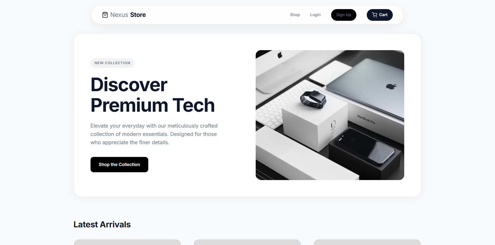
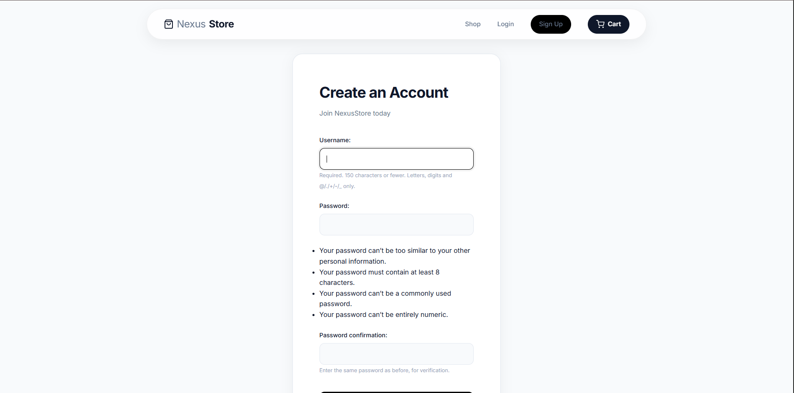
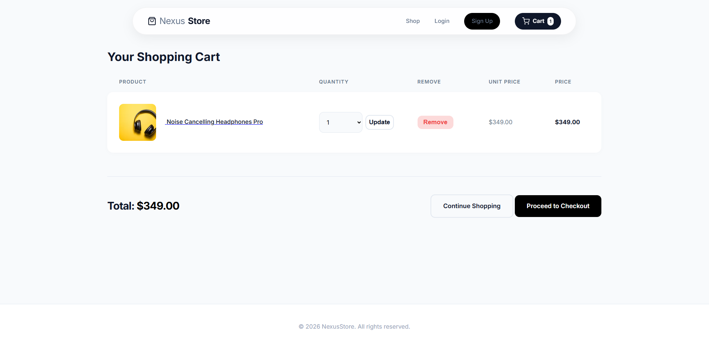

# NexusStore - Premium E-Commerce Application 🚀

Welcome to **NexusStore**, a highly optimized, fully functional, and visually stunning e-commerce application built with Django and zero-dependency Vanilla Front-End technologies. This project perfectly encapsulates modern web standards, featuring dynamic session handling, native authentication, and an ultra-premium UI designed for high conversions.

## 🌟 Key Features
- **Modern Retail Aesthetics**: A beautiful, bright interface drawing inspiration from top-tier brands like Apple and Zara.
- **Robust User Authentication**: Fully integrated Native Django Auth system allowing user registration, login, and secure sessions.
- **State-of-the-art Shopping Cart**: Uses server-side session management to let users effortlessly manage items in their cart.
- **Relational Order History**: Every order placed is permanently bound to the user's account for easy tracking and historical consistency.
- **Split-Hero Layout**: A highly converting, meticulously crafted hero section designed to capture user attention instantly.
- **SQL Database Integration**: Leverages a fully normalized SQLite relational database to handle complex user:order relations safely.

## 📸 Screenshots


### Home Page & Premium Hero Layout


### User Registration


### Dynamic Session Cart


## 🛠️ Technology Stack
- **Backend**: Python, Django 6.x
- **Frontend**: HTML5, Vanilla CSS3 (Custom Design System), JavaScript
- **Database**: SQLite3
- **Dependency Management**: Python `venv` + `requirements.txt`

## 🚀 Quickstart Guide

1. **Clone the Repository**
   ```bash
   git clone <your-repo-url>
   cd CodeAlpha_E-commerce_Store
   ```

2. **Activate Virtual Environment** (Windows)
   ```bash
   ..\venv\Scripts\activate
   ```

3. **Migrate the Database**
   ```bash
   python manage.py migrate
   ```

4. **Seed the Database (Optional)**
   Instantly populate your store with stunning placeholder products.
   ```bash
   python seed.py
   ```

5. **Run the Server**
   ```bash
   python manage.py runserver
   ```
   Navigate to `http://127.0.0.1:8000/` and enjoy!

## 🎓 Internship Requirements Checklist
- [x] Basic e-commerce site with product listings.
- [x] Frontend: HTML, CSS, JavaScript.
- [x] Backend: Django.
- [x] Features: Shopping cart, Product details page, Order processing.
- [x] **User Registration/Login**.
- [x] **Database for storing products, users, and orders**.

---
*Developed for the CodeAlpha Internship Program.*
